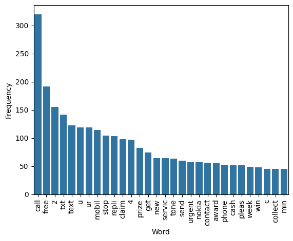
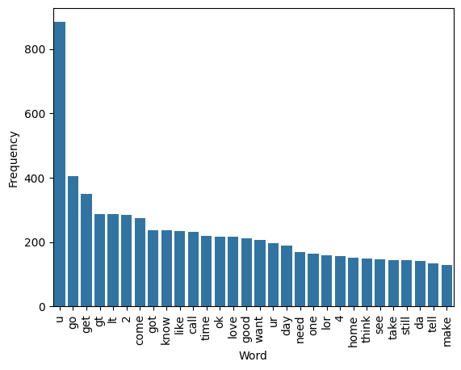

# **Introduction:**

This project is a machine learning project aimed at identifying and filtering out spam messages from legitimate ones in SMS communication. With the ever-increasing volume of unsolicited and potentially harmful messages being sent via SMS, there is a growing need for automated systems that can effectively differentiate between spam and non-spam messages.

The project utilizes various machine learning algorithms and techniques to analyse the content of incoming SMS messages and classify them as either spam or not spam.

Key components of the SMS Spam Detection System include:

1. **Data Collection and Preprocessing:** Gathering a diverse dataset of labelled SMS messages containing both spam and non-spam content. Preprocessing involves cleaning the text, removing noise, and transforming it into a format suitable for machine learning models.
1. **Feature Extraction:** Extracting relevant features from the text data, such as word frequency, number of characters and number of lines. These features are used to analyse various attributes of spam messages.
1. **Model Selection and Training:** Experimenting with various machine learning algorithms such as Naive Bayes, Support Vector Machines (SVM), Random Forest, Logistic Regression, Adaboost Classifier, etc. Training involves feeding the labelled data into these models to learn patterns and associations between features and classes.
1. **Evaluation and Optimization:** Assessing the performance of the trained models using metrics like accuracy, precision. Fine-tuning the models and optimizing hyperparameters to improve their effectiveness in distinguishing between spam and non-spam messages.
1. **Integration with UI:** Integrating the trained model into a user-friendly interface using streamlit that can process SMS messages and give the user feedback. 

## **Algorithms Used:**
1. Logistic Regression (LogisticRegression)
1. Support Vector Machine (SVC)
1. Decision Tree (DecisionTreeClassifier)
1. k-Nearest Neighbors (KNeighborsClassifier)
1. Random Forest (RandomForestClassifier)
1. AdaBoost (AdaBoostClassifier)
1. Bagging (BaggingClassifier)
1. Extra Trees (ExtraTreesClassifier)
1. Gradient Boosting (GradientBoostingClassifier)
1. XGBoost (XGBClassifier)
1. Gaussian Naive Bayes (GaussianNB)
1. Multinomial Naive Bayes (MultinomialNB)
1. Bernoulli Naive Bayes (BernoulliNB)
## **Dataset Used:**
Print(‘spam.csv’):


5572 rows × 2 columns

## **Libraries Used:**
- Pandas
- Numpy
- Scikit-learn
- Chardet
- Matplotlib
- Seaborn
- Natural Language Toolkit
- String
- Word Cloud
- Collections
- Pickle
## **Imports Used:**
```python
import pandas as pd
import numpy as np
import chardet
from sklearn.preprocessing import LabelEncoder
import matplotlib.pyplot as plt
import nltk
import seaborn as sns
from nltk.corpus import stopwords
import string
from nltk.stem.porter import PorterStemmer
from wordcloud import WordCloud
from collections import Counter
from collections import Counter
from sklearn.feature_extraction.text import CountVectorizer, TfidfVectorizer
from sklearn.model_selection import train_test_split
from sklearn.naive_bayes import GaussianNB, MultinomialNB, BernoulliNB
from sklearn.linear_model import LogisticRegression
from sklearn.svm import SVC
from sklearn.tree import DecisionTreeClassifier
from sklearn.neighbors import KNeighborsClassifier
from sklearn.ensemble import RandomForestClassifier
from sklearn.ensemble import AdaBoostClassifier
from sklearn.ensemble import BaggingClassifier
from sklearn.ensemble import ExtraTreesClassifier
from sklearn.ensemble import GradientBoostingClassifier
from xgboost import XGBClassifier
from sklearn.metrics import accuracy_score, confusion_matrix, precision_score
from sklearn.preprocessing import MinMaxScaler
from sklearn.ensemble import VotingClassifier
import pickle
```

# **Data Cleaning:**

## **1. Removing and Renaming columns:**

```python
data.drop(columns=["Unnamed: 2", "Unnamed: 3", "Unnamed: 4"], inplace=True)
data.rename(columns={'v1': 'target', 'v2': 'text'}, inplace=True)
print(data.sample(5))
```

Output:


## **2. Handling missing and duplicate values:**

```python
print(data.isnull().sum())
print(data.duplicated().sum())
data = data.drop_duplicates(keep="first")
print(data.duplicated().sum())
print(data.shape)
```

Output:

403

0

(5169, 2)


# **Exploratory Data Analysis (EDA):**

## **1. Number of spam and ham messages in Data:**

```python
import matplotlib.pyplot as plt

print(data['target'].value_counts())
plt.pie(data['target'].value_counts(), labels=['ham', 'spam'], autopct="%0.2f")
plt.show()
```

Output:

target

0  -  4516

1  -  653


We have a lot more ‘not spam’ messages than ‘spam’ messages in the data. So, we should work on it while keeping this in mind.

## **2. Characters, Words and Sentences frequency:**

```python
import nltk

nltk.download('punkt') 

data['num_characters'] = data['text'].apply(len)
data['num_words'] = data['text'].apply(lambda x: len(nltk.word_tokenize(x)))
data['num_sentences'] = data['text'].apply(lambda x: len(nltk.sent_tokenize(x)))

# ham messages description
print(data[data['target']==0][["num_characters", "num_words", "num_sentences"]].describe())
```

Output:


```python
# spam messages description
Print(data[data['target']==1][["num_characters", "num_words", "num_sentences"]].describe())
```

Output:


Showing the same thing using graphs:

```python
import seaborn as sns

plt.figure(figsize=(12, 6))
sns.histplot(data[data['target'] == 0]["num_characters"])
sns.histplot(data[data['target'] == 1]["num_characters"], color="red")
plt.show()
```

Output:


```python
plt.figure(figsize=(12, 6)) 
sns.histplot(data[data['target'] == 0]["num_words"])
sns.histplot(data[data['target'] == 1]["num_words"], color="red")
plt.show()
```

Output:


```python
sns.pairplot(data, hue="target")
plt.show()
```

Output:


The frequency of characters, words and lines is mostly higher in ‘spam’ than ‘not spam’.

## **3. Checking the relation of target with message length:**

```python
sns.heatmap(data.corr(numeric_only=True), annot=True)
plt.show()
```

Output:


There is multicollinearity in the columns so we should only choose one of these in input columns. The highest corelation with target column is of ‘num_characters’ so we are using it.


# **Data preprocessing:**

We are working on text data and there are majorly 5 things to perform on it:

1. Lower case
1. Tokenization
1. Removing special characters of English
1. Removing stop words and punctuation
1. Stemming

We are using Natural Language Toolkit (NLTK) to perform the tokenization, removing the stop words and stemming:

```python
from nltk.corpus import stopwords
import string
from nltk.stem.porter import PorterStemmer

ps = PorterStemmer()

def transform_text(text):

    # lowercase
    text = text.lower()

    # tokenize
    text = nltk.word_tokenize(text)

    # removing special chars(%, etc)
    y = []

    for i in text:
        if i.isalnum():
            y.append(i)

    text = y[:]
    y.clear()

    # removing stopwords and punctuation
    for i in text:
        if i not in stopwords.words('english') and i not in string.punctuation:
            y.append(i)

    text = y[:]
    y.clear()

    # stemming
    for i in text:
        y.append(ps.stem(i))
    return " ".join(y)

data["transformed_text"] = data['text'].apply(transform_text)

print(data.head())
```

Output:


**Now let’s analyse which word is used the most in spam and ham messages using a word cloud:**

```python
from wordcloud import WordCloud

wc = WordCloud(width=500, height=500, min_font_size=10, background_color="white")

\# spam wordcloud:
spam_wc = wc.generate(data[data['target']==1]['transformed_text'].str.cat(sep=" "))
plt.figure(figsize=(15, 8))
plt.imshow(spam_wc)
```

Output:


```python
# ham wordcloud
ham_wc = wc.generate(data[data['target']==0]['transformed_text'].str.cat(sep=" "))
plt.figure(figsize=(15, 8))
plt.imshow(ham_wc)
```

Output:


**Let’s visualise it using a bar chart for better understanding:**

```python
from collections import Counter

spam_corpus = []

for msg in data[data['target']==1]['transformed_text'].tolist():
    for word in msg.split():
        spam_corpus.append(word)

spam_counts = Counter(spam_corpus).most_common(30)
df = pd.DataFrame(spam_counts, columns=['Word', 'Frequency'])
sns.barplot(x='Word', y='Frequency', data=df)
plt.xticks(rotation='vertical')
plt.show()
```

Output:



```python
ham_corpus = []

for msg in data[data['target']==0]['transformed_text'].tolist():
    for word in msg.split():
        ham_corpus.append(word)

from collections import Counter
ham_counts = Counter(ham_corpus).most_common(30)
df = pd.DataFrame(ham_counts, columns=['Word', 'Frequency'])

sns.barplot(x='Word', y='Frequency', data=df)
plt.xticks(rotation='vertical')
plt.show()
```

Output:




# **Model Building:**

**Let’s prepare the data for model building:**

```python
from sklearn.feature_extraction.text import CountVectorizer, TfidfVectorizer

cv = CountVectorizer()
tfidf = TfidfVectorizer()

X = tfidf.fit_transform(data["transformed_text"]).toarray()
y = data['target'].values

from sklearn.model_selection import train_test_split

X_train, X_test, y_train, y_test = train_test_split(X, y, test_size=0.2, random_state=2)
```

We are going to use Naïve bayes algorithms since we are working on text data, Naïve bayes algorithms seems to perform better than any other classification problems:

```python
from sklearn.naive_bayes import GaussianNB, MultinomialNB, BernoulliNB
from sklearn.metrics import accuracy_score, confusion_matrix, precision_score

gnb = GaussianNB()
mnb = MultinomialNB()
bnb = BernoulliNB()

# GaussianNB
gnb.fit(X_train, y_train)
y_pred1 = gnb.predict(X_test)

print(accuracy_score(y_test, y_pred1))
print(confusion_matrix(y_test, y_pred1))
print(precision_score(y_test, y_pred1))
```

Output:

0.8762088974854932

[[793 103]

[ 25 113]]

0.5231481481481481

```python
# MultinomialNB

mnb.fit(X_train, y_train)
y_pred2 = mnb.predict(X_test)

print(accuracy_score(y_test, y_pred2))
print(confusion_matrix(y_test, y_pred2))
print(precision_score(y_test, y_pred2))
```

Output:

0\.9593810444874274

[[896   0]

[ 42  96]]

1.0

```python
# BernoulliNB**
bnb.fit(X_train, y_train)
y_pred3 = bnb.predict(X_test)

print(accuracy_score(y_test, y_pred3))
print(confusion_matrix(y_test, y_pred3))
print(precision_score(y_test, y_pred3))
```

Output:

0\.9700193423597679

[[893   3]

 [ 28 110]]

0\.9734513274336283

**Result:**

In text data analysis, precision is paramount for ensuring accurate classification. Among the Naïve Bayes algorithms tested, **MultinomialNB** outperforms the others, exhibiting a precision of approximately 100%, and has a considerably good accuracy of 95.94% indicating that it is correctly identifying relevant instances within the dataset.
**

# **Comparing MultinomialNB with other Models:**

```python
from sklearn.linear_model import LogisticRegression
from sklearn.svm import SVC
from sklearn.naive_bayes import MultinomialNB
from sklearn.tree import DecisionTreeClassifier
from sklearn.neighbors import KNeighborsClassifier
from sklearn.ensemble import RandomForestClassifier
from sklearn.ensemble import AdaBoostClassifier
from sklearn.ensemble import BaggingClassifier
from sklearn.ensemble import ExtraTreesClassifier
from sklearn.ensemble import GradientBoostingClassifier
from xgboost import XGBClassifier

svc = SVC(kernel='sigmoid', gamma=1.0)
knc = KNeighborsClassifier()
mnb = MultinomialNB()
dtc = DecisionTreeClassifier(max_depth=5)
lrc = LogisticRegression(solver='liblinear', penalty='l1')
rfc = RandomForestClassifier(n_estimators=50, random_state=2)
abc = AdaBoostClassifier(n_estimators=50, random_state=2)
bc = BaggingClassifier(n_estimators=50, random_state=2)
etc = ExtraTreesClassifier(n_estimators=50, random_state=2)
gbdt = GradientBoostingClassifier(n_estimators=50,random_state=2)
xgb = XGBClassifier(n_estimators=50,random_state=2)

clfs = {
    'SVC' : svc,
    'KN' : knc, 
    'NB': mnb, 
    'DT': dtc, 
    'LR': lrc, 
    'RF': rfc, 
    'AdaBoost': abc, 
    'BgC': bc, 
    'ETC': etc,
    'GBDT':gbdt,
    'xgb':xgb
}

accuracy_scores = []
precision_scores = []

for name,clf in clfs.items():
    current_accuracy,current_precision = train_classifier(clf, X_train,y_train,X_test,y_test)
    
    print("For ",name)
    print("Accuracy - ",current_accuracy)
    print("Precision - ",current_precision)
    
    accuracy_scores.append(current_accuracy)
    precision_scores.append(current_precision)

performance_df=pd.DataFrame({'Algorithm':clfs.keys(),'Accuracy':accuracy_scores,'Precision':precision_scores}).sort_values('Precision',ascending=False)
print(performance_df)
```

Output:


**Result:**

We could see that there are 3 algorithms which are performing really good in precision score:

1. KNeighborsClassifier
1. RandomForestClassifier
1. MultinomialNB

But KNeighborsClassifier’s accuracy is pretty low against the other 3, so we can discard it. But on the other hand  RandomForestClassifier is actually outperforming the MultinomialNB in accuracy. I think we can improve these models even further by tweaking some hyperparameters.


# **Optimizing Hyperparameters:**

## **1. Change the max_features parameter of TfIdf:**

I tried different values of max_features parameter, but 3000 is giving me the best results. So let’s see how much improvement it can give us.

```python
tfidf = TfidfVectorizer(max_features=3000)
X = tfidf.fit_transform(data["transformed_text"]).toarray()
X_train, X_test, y_train, y_test = train_test_split(X, y, test_size=0.2, random_state=2)
train_classifier(mnb,X_train,y_train,X_test,y_test)

accuracy_scores = []
precision_scores = []

for name,clf in clfs.items():
    current_accuracy,current_precision = train_classifier(clf, X_train,y_train,X_test,y_test)

    print("For ",name)
    print("Accuracy - ",current_accuracy)
    print("Precision - ",current_precision)

    accuracy_scores.append(current_accuracy)
    precision_scores.append(current_precision)

temp_df=pd.DataFrame({'Algorithm':clfs.keys(),'Accuracy_max_ft_3000':accuracy_scores,'Precision_max_ft_3000':precision_scores}).sort_values('Precision_max_ft_3000',ascending=False)
new_df = performance_df.merge(temp_df,on='Algorithm')
print(new_df)
```

Output:


**Result:**

So, you see after tuning the parameters, the accuracy of MultinomialNB has improved from 95.93% to 97.09% and RandomForest’s accuracy has improved from 97.19% to 97.58%. But the precision score of RandomForest has reduced to 98.29% (100% previously).

## **2. Scaling the input columns:**
Scaling the input columns is a common enhancement in ML models, aimed at improving performance. However, in this case, despite the potential precision gains, the accuracy decreased, suggesting that feature scaling might have introduced distortion or suppressed crucial information in the dataset. So, I discarded this step.
## **3. Ensemble Learning:**

**Voting:**

```python
from sklearn.ensemble import VotingClassifier

svc = SVC(kernel='sigmoid', gamma=1.0,probability=True)
mnb = MultinomialNB()
rfc = RandomForestClassifier(n_estimators=50, random_state=2)

voting = VotingClassifier(estimators=[('svm', svc), ('nb', mnb), ('rf', rfc)],voting='soft')

voting.fit(X_train, y_train)
y_pred = voting.predict(X_test)

print("Accuracy",accuracy_score(y_test,y_pred))
print("Precision",precision_score(y_test,y_pred))
```

Output:

Accuracy 0.9777562862669246

Precision 0.9831932773109243

**Stacking:**

```python
from sklearn.ensemble import StackingClassifier

estimators=[('svm', svc), ('nb', mnb), ('rf', rfc)]
final_estimator=RandomForestClassifier()

clf = StackingClassifier(estimators=estimators, final_estimator=final_estimator)

clf.fit(X_train,y_train)
y_pred = clf.predict(X_test)

print("Accuracy",accuracy_score(y_test,y_pred))
print("Precision",precision_score(y_test,y_pred))
```

Output:

Accuracy 0.9787234042553191

Precision 0.9393939393939394

**Result:**

Again, using ensemble learning in this case resulted in diminished accuracy and precision. This suggests that the combination of models within the ensemble may have introduced conflicting decision boundaries or overfitting.


## **Final Output:**
After comparing all the models and adding the improvements to them, the best performing model comes out to be **MutilnomialNB,** the accuracy and precision score is:

**Accuracy: 97.098%**

**Precision score: 100%**

## **Exporting Model:**
```python
import pickle

pickle.dump(tfidf,open('vectorizer.pkl','wb'))
pickle.dump(mnb,open('model.pkl','wb'))
```

# **Integration with UI:**

We are using ‘streamlit’ for creating a webpage which the users can use to interact with the model so that they can classify their SMS

```python
import streamlit as st
import pickle
import nltk
from nltk.corpus import stopwords
import string
from nltk.stem.porter import PorterStemmer

tfidf = pickle.load(open('vectorizer.pkl', 'rb'))
model = pickle.load(open('model.pkl', 'rb'))

st.title("SMS Spam Classifier")
input_sms = st.text_area("Enter the message")

def transform_text(text):
    # lowercase
    text = text.lower()

    # tokenize
    text = nltk.word_tokenize(text)

    # removing special chars(%, etc)
    y = []
    for i in text:
        if i.isalnum():

            y.append(i)

    text = y[:]
    y.clear()

    # removing stopwords and punctuation
    for i in text:
        if i not in stopwords.words('english') and i not in string.punctuation:
            y.append(i)

    text = y[:]
    y.clear()

    # stemming
    for i in text:
        ps = PorterStemmer()
        y.append(ps.stem(i))

    return " ".join(y)

if st.button("predict"):
    # 1. preprocess
    transformed_sms = transform_text(input_sms)

    # 2. vectorize
    vector_input = tfidf.transform([transformed_sms])

    # 3. predict
    result = model.predict(vector_input)[0]

    # 4. Display
    if (result == 1):
        st.header("Spam")

    else:
        st.header("Not Spam")
```

Output:


